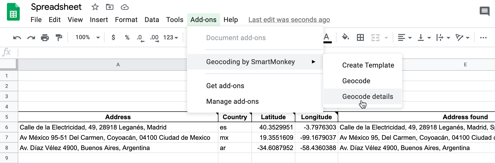

# Leaflet Storymaps with Google Sheets
Customize your Leaflet story map with linked Google Sheets template and scrolling narrative.
Supports images, audio and video embeddings, and Leaflet TileLayer/geojson overlays.

  

## Live links 
- Leaflet Map (https://sagesteppe.github.io/resumeStoryMap/#1)
- Data entry (https://docs.google.com/spreadsheets/d/1UZQKIhkMuUKZVOXzDkNS83qdgEt3id9ls5CnH8wawkE/edit?gid=0#gid=0)  

## Create Your Own
- See step-by-step tutorial in *Hands-On Data Visualization* https://HandsOnDataViz.org/leaflet-storymaps-with-google-sheets.html

#### Geocode your address data with Google Sheets add-on
To geocode (find latitude and longitude coordinates), we recommend installing the free [Geocoding by SmartMonkey add-on for Google Sheets](https://gsuite.google.com/marketplace/app/geocoding_by_smartmonkey/1033231575312). Insert your addresses in place of the samples in the Geocoding Details tab, then use Add-Ons > Geocoding > Geocode Details menu. Learn more in *Hands-On Data Visualization* https://handsondataviz.org/geocode.html

#### To finalize your map, you need to either:
- Download each Google Sheets tab as a CSV file and upload into a `csv` subfolder in your GitHub repo
  - OR
- Get your own Google Sheets API Key to insert into `google-doc-url.js`

See more in the tutorial https://handsondataviz.org/leaflet-storymaps-with-google-sheets.html

Option C: Start over with a brand-new repo, and migrate your existing map content. Make a copy of our newer code by clicking the green 'Use template' button. Migrate any media folder or geodata folder content from your old repo to your new repo, by downloading to your local computer and uploading to GitHub. Reconnect your Google Sheet ID to the `google-doc-url.js` file in your new repo.

Email us at [HandsOnDataViz@gmail.com](handsondataviz@gmail.com) if you need assistance with updating your code.
